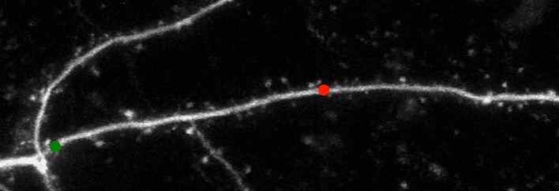
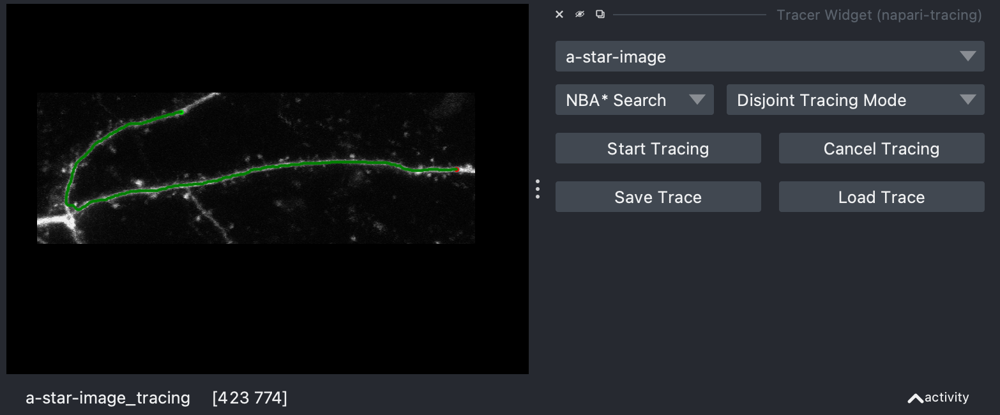

The `brightest-path-lib` is a Python library which allows users to efficiently find the path with the maximum brightness in a 2D or 3D images. It uses the A\* Search and NBA\* Search algorithms, which are informed search algorithms that use heuristics to guide the search towards the most promising areas of the image.

<!-- <figure markdown>
  
  <figcaption>Finding Brightest Path using A* Search</figcaption>
</figure>
<figure markdown>
  
  <figcaption>Finding Brightest Path using NBA* Search</figcaption>
</figure> -->

## Examples

In these examples, a search is performed from the user specified start (green) and stop (red) points. The progress of the search is animated as cyan fill color and the final brightest-path is shown in yellow.

Finding Brightest Path using A* Search

Finding Brightest Path using NBA* Search

## Capabilities

With its efficient implementation and intuitive API, this library is a valuable tool for anyone working with 2D or 3D images who needs to identify the path with the maximum brightness.

- The library provides easy-to-use functions that take the image data and start and end points as input and return the path with the maximum brightness as output.
- It supports both grayscale and color images and can handle images of arbitrary sizes.
- The library also provides support for users to know which points in the image are being considered for the brightest path in real-time so that they display them on the original image.

## Napi Plugin

We have also created a [Napari Tracing Plugin](https://github.com/mapmanager/napari-tracing) to provide an intuititive graphical-user-interface that uses the `brightest-path-lib`` package. We are using this to trace neuronal dendrites and axons.

